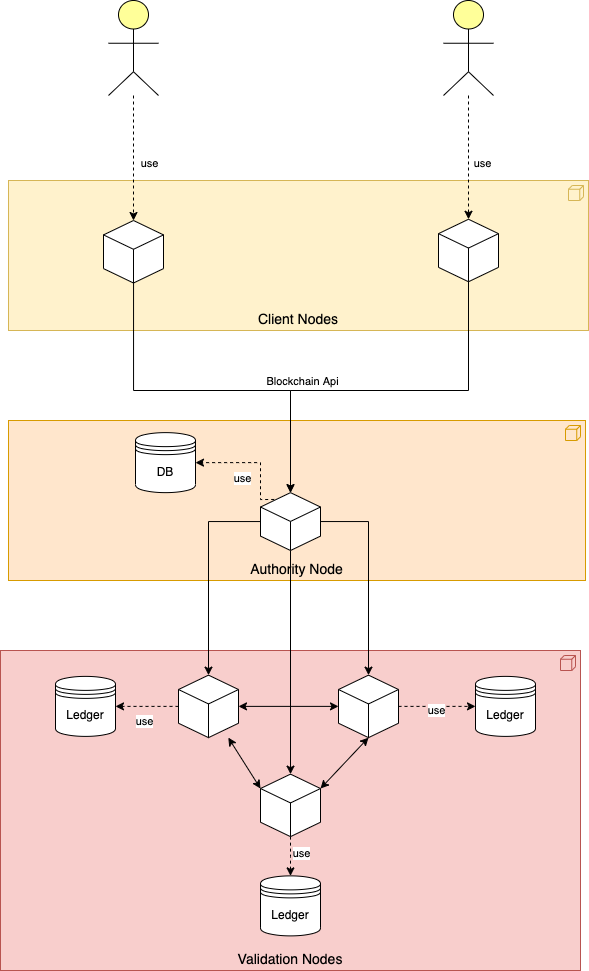
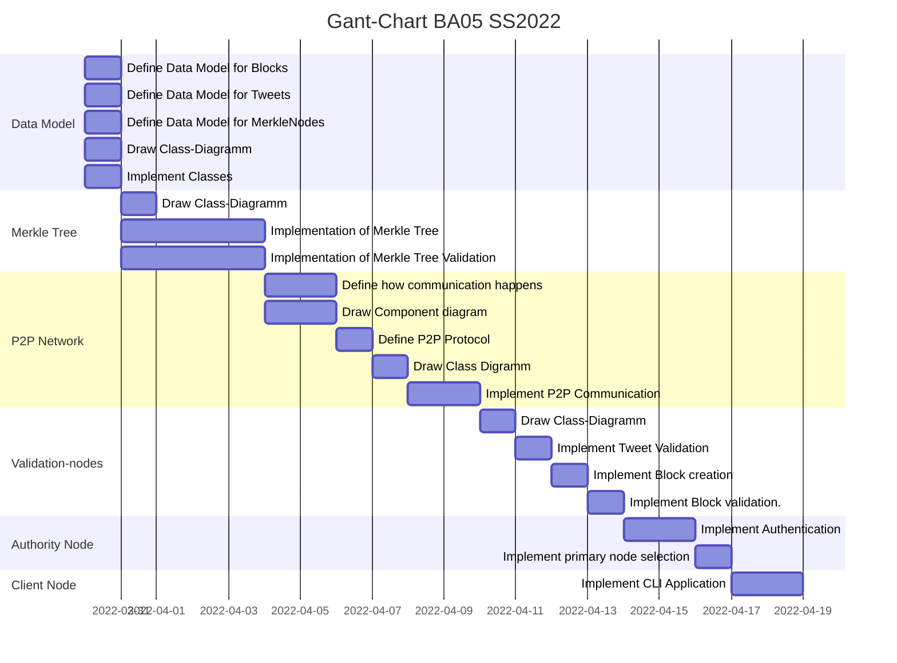

# Thesis Proposal

## Goals:
- Implementation of a private blockchain system, that allows users to post tweets
- Hash Algorithm: SHA-256
- **Nodes**:
    - **Authority node**:
        - provides the blockchain api: `register`, `login`, `post-tweet`, `get-tweets`
        - implement the selection of the primary node that creates a the next block
    - **Validation nodes**: 
        - store the full ledger 
        - mine, create and validate blocks
        - calculate and validate merkle trees
        - validate tweets
        - use proof-of-authority consensus algorithm
    - **Client nodes**: 
        - provide CLI applciation to interact with the blockchain

## Target Architecture:

---

## Milestones:
- Data Model:
    - Blocks
    - Tweets
    - MerklNodes
- Merkle Tree:
    - Creation
    - Validation
- Tweet Validation:
    - check signatures
- P2P Network:
    - communication between validation nodes
    - commuincation between validation nodes and authority node
    - define payloads and message types
- Validation Nodes:
    - Block mining
    - Block validation
    - Integrate into P2P Network
- Authority Node:
    - Authentication: `/login`, `/register`
    - Endpoint for posting tweet
    - Ednpoitn for fetching tweets
- Client Node
    - CLI that makes requests to the different endpoints

--- 

## Proposed Deadlines:

